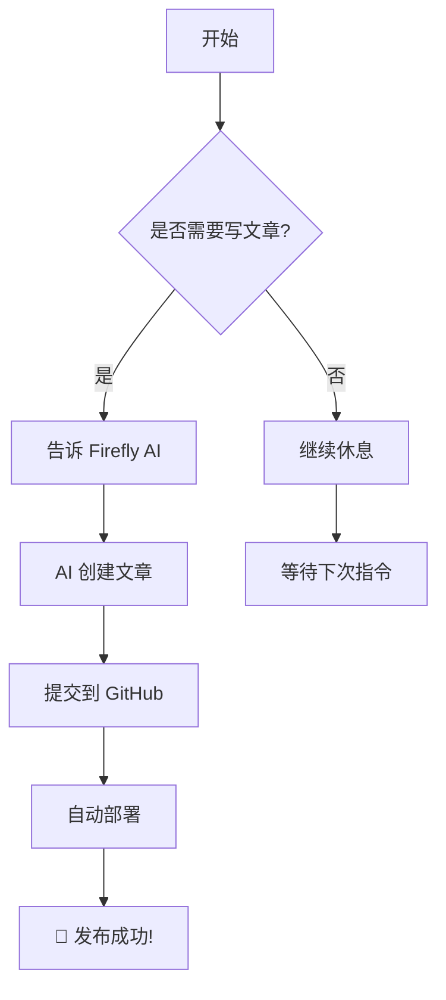
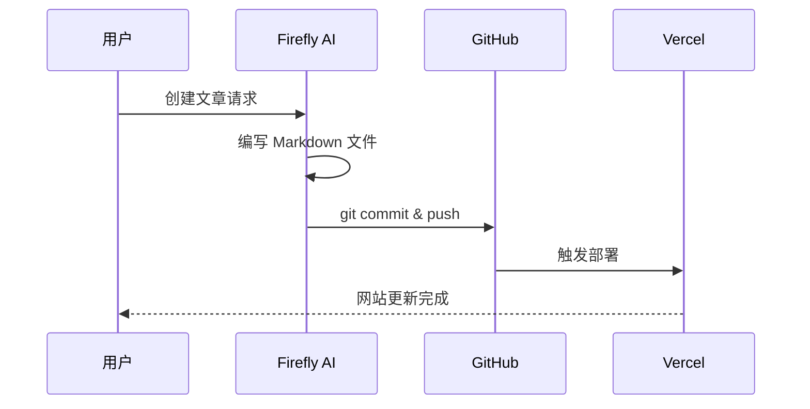
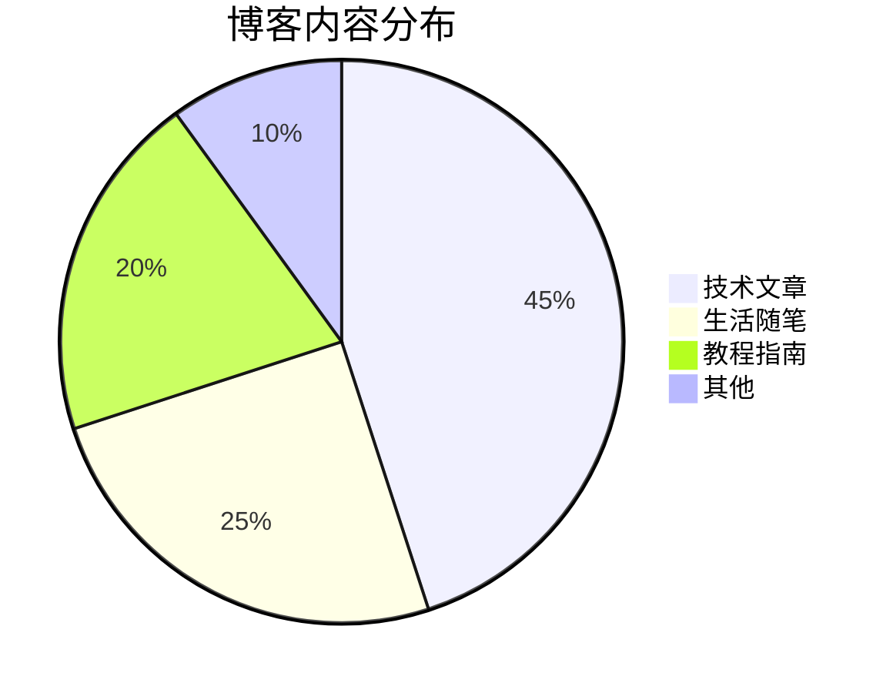

# 🌟 Firefly 博客助手测试文章

欢迎！这是由 **Firefly AI 博客助手** 创建的测试文章。本文将展示 Firefly 博客系统的各种功能和特性。

## 📝 文章元数据

当前文章包含以下元数据：

- **标题**: Firefly 博客助手测试
- **发布日期**: 2026-02-28
- **作者**: Firefly AI
- **标签**: Firefly, AI助手, 测试, Markdown
- **分类**: 测试
- **状态**: 已发布

## 🎯 功能展示

### 1. 文本格式化

**粗体文本** 和 *斜体文本* 以及 ***粗斜体文本***。

还可以使用 ~~删除线~~ 标记废弃内容。

### 2. 列表

#### 无序列表

- 第一项
- 第二项
  - 子项 2.1
  - 子项 2.2
- 第三项

#### 有序列表

1. 第一步：理解需求
2. 第二步：分析问题
3. 第三步：实施方案
4. 第四步：验证结果

### 3. 引用块

> 这是一个普通的引用块。
>
> 可以包含多行内容。

> [!NOTE] 提示信息
> 这是一个提示框，用于突出显示用户应该注意的信息。

> [!TIP] 建议
> 这是建议框，提供可选信息帮助用户更成功。

> [!WARNING] 警告
> 这是警告框，提示需要立即注意的内容。

> [!IMPORTANT] 重要
> 这是重要信息，用户必须了解的关键内容。

### 4. 代码块

#### JavaScript 代码

```javascript
// 这是一个简单的 JavaScript 示例
function greet(name) {
  return `Hello, ${name}! Welcome to Firefly Blog!`;
}

console.log(greet('World'));
```

#### Python 代码

```python
# Python 示例
def fibonacci(n):
    if n <= 1:
        return n
    return fibonacci(n-1) + fibonacci(n-2)

# 计算前 10 个斐波那契数
for i in range(10):
    print(f"F({i}) = {fibonacci(i)}")
```

#### Bash 命令

```bash
# 克隆 Firefly 仓库
git clone https://github.com/CuteLeaf/Firefly.git my-blog

# 进入目录
cd my-blog

# 安装依赖
pnpm install

# 启动开发服务器
pnpm dev
```

### 5. 表格

| 功能 | 状态 | 说明 |
|------|------|------|
| 📝 文章管理 | ✅ | 支持 Markdown/MDX 格式 |
| 🎨 外观定制 | ✅ | 字体、颜色、背景可配置 |
| ⚙️ 评论系统 | ✅ | 支持多种评论服务 |
| 🎵 音乐播放器 | ✅ | 集成 APlayer |
| 🖼️ 相册功能 | ✅ | 瀑布流布局 |
| 🌸 樱花特效 | ✅ | 可爱的飘落动画 |

### 6. 数学公式

Firefly 支持使用 KaTeX 渲染数学公式。

#### 行内公式

欧拉公式 $e^{i\pi} + 1 = 0$ 被誉为数学中最优美的公式。

#### 块级公式

$$
\int_{-\infty}^{\infty} e^{-x^2} dx = \sqrt{\pi}
$$

#### 矩阵

$$
\begin{pmatrix}
a & b \\
c & d
\end{pmatrix}
\times
\begin{pmatrix}
x \\
y
\end{pmatrix}
=
\begin{pmatrix}
ax + by \\
cx + dy
\end{pmatrix}
$$

#### 求和公式

$$
\sum_{n=1}^{\infty} \frac{1}{n^2} = \frac{\pi^2}{6}
$$

### 7. Mermaid 图表

#### 流程图



#### 时序图



#### 饼图



### 8. 嵌入 GitHub 仓库卡片

::github{repo="CuteLeaf/Firefly"}

### 9. 分隔线

---

## 🔧 Firefly 博客助手能力

### 核心功能

1. **📝 内容创作**
   - 编写高质量 Markdown 文章
   - 优化文章结构和可读性
   - 管理标签、分类、封面图

2. **🎨 外观定制**
   - 调整配色和字体
   - 优化背景和封面
   - 响应式设计优化

3. **⚙️ 功能集成**
   - 配置评论系统
   - 添加音乐播放器
   - 创建相册页面
   - 配置看板娘和特效

4. **🚀 部署运维**
   - Git 版本管理
   - 自动化部署
   - 性能优化
   - 模板更新

### 工作流程

```
用户需求 → AI 分析 → 本地修改 → Git 提交 → 推送 → 自动部署
```

## 🎉 测试总结

如果这篇测试文章能够正常显示，说明：

- ✅ Firefly AI 助手可以创建文章
- ✅ Frontmatter 元数据配置正确
- ✅ Markdown 语法渲染正常
- ✅ 数学公式显示正常
- ✅ Mermaid 图表生成正常
- ✅ Git 自动提交和推送成功
- ✅ 自动部署流程正常

---

**文章创建时间**: 2026-02-28 06:30 UTC
**创建者**: Firefly AI 博客助手 🌟
**仓库**: https://github.com/TWO-ICE/Fireflyblog

> [!TIP]
> 这是 Firefly 博客助手的第一篇测试文章。如果一切正常，说明整个自动化流程已经就绪！🎉
